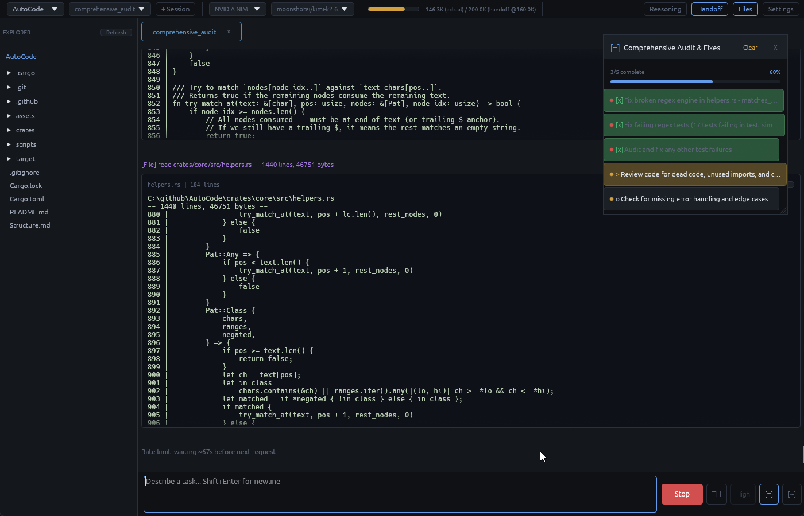

# AutoCode

**AutoCode** is an autonomous AI coding agent — a native desktop application written in **Rust** that connects to large language models (LLMs) and gives them full access to your filesystem and shell, enabling them to independently perform software engineering tasks.

Write code, run commands, edit files, search your codebase, and iterate — all through a chat interface where the AI operates as your autonomous agent. Not a harness or scaffold — a single self-contained binary.

> **[v0.2.0 Pre-Release](https://github.com/Eric-Lautanen/AutoCode/releases/tag/v0.2.0)** — Download the latest build for Windows, Linux, and macOS



## Features

- **AI-Powered Autonomous Coding** — The AI can read, write, edit (with 7-strategy fuzzy patch matching), search, and execute code across your projects using 20 built-in tools
- **Multi-Provider Support** — OpenRouter, NVIDIA NIM, OpenAI-Compatible, or OpenCode Go API endpoints, with per-model manifests for context windows, output limits, thinking API support, reasoning efforts, and per-provider rate limits (`requests_per_hour`) editable in Settings
- **File Editing** — Surgical find-and-replace with 7-strategy fuzzy matching (exact → CRLF-normalized → whitespace-normalized → tabs-normalized → anchored line matching → Myers DP sequence alignment → single-line fuzzy fallback), plus `patch_lines` for line-number-based replacement and full `write_file`/`read_entire_file` support
- **Streaming Responses** — Real-time SSE streaming with automatic recovery and retry logic (transient vs permanent error classification with exponential backoff, retries forever for transient errors). Auto-continues on stream drop when session or project tasks are incomplete
- **Session Management** — Multiple named sessions per project (up to 50), full history via JSONL-backed storage, atomic writes, orphan message scavenging, lazy-load display buffering, per-project tab colors
- **Token Budgeting** — Three-tier token counting (API endpoint → tiktoken offline → heuristic fallback), automatic handoff when approaching context limits (with configurable threshold percentage and trigger prompt), configurable display window and scroll paging
- **Session Auto-Naming** — AI-captured session names are sanitized (alphanumeric + dash + underscore + space, truncated at 80 chars)
- **File Explorer** — Browse your projects with gitignore-aware tree view (shows all files including hidden), file preview (text with syntax highlighting + images), inline rename/delete with context menu, horizontal scrollbar
- **Task Tracking** — Session-level floating todo list with progress bar, priority indicators (colored dots), and auto-close on completion. **Project-level task list** persists across sessions via disk-backed metadata, with auto-recovery when stream drops mid-task
- **Session Handoff** — Automatic session continuation when context limits are reached, with trigger prompt warning, summarization prompt support, and RESUME.md generation
- **System Info Detection** — Automatic OS, CPU, GPU, RAM, shell, and tool availability detection (Windows via Win32 FFI, Unix via `/proc`/`sysctl`/`lspci`)
- **Security Hardening** — API keys stored with heap-zeroing `SecretString`, path traversal detection with cached resolver, shell commands scoped to project directory, temporary file tracking and cleanup on exit, atomic session file writes, `#[must_use]` on security-critical functions
- **Custom Dark Theme** — Full 20-color palette with 72 customizable design colors (bubble/diff/code/terminal/reasoning/badge/semantic), hash-based per-project accent colors, and screen pixel eyedropper (Windows)
- **Cross-Platform** — Windows, macOS, and Linux via egui/eframe with automatic OpenGL/Wgpu renderer selection; FPS drops to 0.5 when minimized
- **Autonomous Security Model** — Fully autonomous operation; no confirmation prompts for shell or file operations (designed for trusted environments)

## Architecture

Built in **Rust** (edition 2024, minimum Rust 1.95) with the **egui** (0.34) immediate-mode GUI framework via **eframe** (0.34). The application runs as a single native binary with **zero async dependencies** — all concurrency is handled via `std::thread` and `std::sync::mpsc` channels. HTTP communication uses raw `TcpStream` + `rustls` (ring crypto provider) with manual SSE parsing and chunked transfer decoding.

### Workspace (5 crates)

```
Cargo.toml                               # workspace root, resolver = "2"
├── .cargo/config.toml                    # +crt-static for MSVC + musl targets
├── assets/
│   ├── providers.json                    # editable provider/model manifest (4 providers, ~42 models)
│   ├── icon.icns / icon.ico              # macOS / Windows icons
│   └── linux/                           # Linux icons (16–512px)
├── crates/
│   ├── autocode/          — binary entry (~583 lines)
│   │   ├── main.rs         (51)    # entry point, rustls init, eframe::run_native (1400x900)
│   │   ├── app.rs         (527)   # AutocodeApp (eframe::App), frame loop, state wiring
│   │   ├── build.rs        (4)    # embed Windows icon resource
│   │   └── helpers.rs      (1)    # reserved
│   ├── core/               — core types, utilities, infrastructure (~5,617 lines)
│   │   ├── state.rs      (1495)  # AppState, Project, Session, ChatMessage, ApiProvider,
│   │   │                           SecretString, DesignSettings (72 fields), TodoItem, manifest
│   │   ├── helpers.rs    (1436)  # ID gen, token estimation (heuristic + tiktoken + regex),
│   │   │                           path resolution + traversal guard, tiny regex engine
│   │   ├── fsutil.rs      (148)   # exe_dir, \\?\ extended paths, atomic read/write, TEMP_FILES
│   │   ├── theme.rs      (140)   # dark Visuals+Style, Palette (20 colors), hash-based project_accent
│   │   ├── extract.rs     (298)   # HTML scraping (scraper), DuckDuckGo results, domain blacklist
│   │   ├── sysinfo.rs     (689)   # OS/CPU/GPU/RAM/shell/tool detection (Win32 FFI, /proc, lspci)
│   │   ├── session_storage.rs (628) # JSON/JSONL persistence, atomic writes, orphan scavenge,
│   │   │                           load_messages_before, truncate_messages_after
│   │   ├── chunked_jsonl.rs (215) # Chunked JSONL (1000 msg/chunk), rotation for large sessions
│   │   ├── persistence.rs  (152)  # Background persistence thread for offloading JSONL writes
│   │   ├── provider_file.rs (225) # User-editable providers.json schema (ProviderEntry, ModelEntry)
│   │   ├── shell_task_storage.rs (82) # Shell task persistence (save/load/delete as JSON files)
│   │   └── tokenizer/
│   │       └── mod.rs      (88)    # Tokenizer trait, TiktokenTokenizer, HeuristicTokenizer
│   ├── ai/                 — AI provider client + chat orchestration (~6,481 lines)
│   │   ├── chat.rs       (3558)  # orchestration: send_message, SSE polling, 20 tool handlers,
│   │   │                           retry/backoff, auto-continuation, handoff, session auto-naming,
│   │   │                           replay, partial-response recovery, live shell streaming
│   │   ├── provider.rs   (1722)  # raw TCP+rustls HTTP client, SSE parsing, 20 tool definitions,
│   │   │                           model list fetch, counting API, rotating browser profiles (8)
│   │   ├── session.rs    (168)   # system prompt seeding + sysinfo, message prep with dedup,
│   │   │                           orphan-tool stripping, cache_control, full-history estimate
│   │   ├── helpers.rs    (895)   # fuzzy find-replace (7 strategies), Levenshtein/Jaro-Winkler/
│   │   │                           token-set similarity, todo parsing, line-number stripping,
│   │   │                           project task parsing
│   │   └── thread_pool.rs (125)  # Background thread pool for concurrent jobs with panic isolation
│   ├── fs/                 — filesystem tools (~915 lines)
│   │   ├── shell.rs       (234)   # background shell via channels (cmd with CREATE_NO_WINDOW, sh),
│   │   │                           temp script cleanup, PID reporting, stderr capture
│   │   ├── explorer.rs    (467)   # gitignore-aware list_dir/glob/grep/find_project_root,
│   │   │                           recursive grep with size/binary limits, project_tree (depth 20)
│   │   └── helpers.rs    (206)   # file extraction from code fences, glob matching (*/**/?)
│   └── ui/                 — egui UI panels (~5,944 lines)
│       ├── ui_chat.rs    (2198)  # chat panel: tabs, bubbles, markdown, diff, streaming, shell,
│       │                           structured tool cards, per-project tab colors, replay button
│       ├── ui_settings.rs(1501)  # 6-tab settings window (Providers/Projects/Prompt/Session/
│       │                           Timeouts/About)
│       ├── ui_explorer.rs (864)  # file tree (all files shown), preview (text+image with edit/
│       │                           save), rename/delete context menu, gutter line numbers
│       ├── ui_toolbar.rs  (340)  # project/session/provider/model pickers, budget meter, blink-dot
│       ├── ui_todo.rs     (285)  # floating session task list, progress bar, priority dots, auto-close
│       ├── ui_project_tasks.rs (297)  # floating project task list, progress bar, auto-close, disk persist
│       └── helpers.rs     (445)  # time formatting, tool result parsing, markdown, LayoutJob,
│                                 screen pixel sampling (Windows FFI), todo_scroll_area
```
**Total: ~19,540 lines of Rust source across 35 files.**

### Key Architecture Decisions

- **No async runtime** — all I/O is blocking on spawned threads; UI polls for results via channels
- **Immediate-mode GUI** — egui rebuilds the entire UI every frame, simplifying state management
- **Disk as source of truth** — message history always written to JSONL immediately; RAM only holds a display window; full history loaded from disk for API requests
- **Custom tool definitions** — all 20 tool definitions hand-written in `provider.rs` for token efficiency
- **Three-tier token estimation** — API counting endpoint → tiktoken offline (model-aware) → heuristic fallback
- **7-strategy fuzzy patch matching** — exact → CRLF-normalized → whitespace-normalized → tabs-normalized → anchored line matching → Myers DP sequence alignment → single-line fuzzy fallback
- **Transient/permanent error classification** — transient errors (rate limits, timeouts, 5xx, 400) get exponential backoff retry (5s → 180s cap, retries forever); permanent errors (auth, quota, content filter) are surfaced immediately
- **Connection: close** — HTTP connections use `Connection: close` to prevent read timeouts with certain providers

### Data Flow

1. **Startup** — `main.rs` installs rustls crypto, loads persisted state from `app.ron`, launches native window (1400×900)
2. **User input** — message typed in chat panel; toolbar provides project/session/provider selection
3. **Chat orchestration** — `chat.rs::send_message()` loads history from disk, prepares request with optional prompt caching, builds API POST with tool definitions, parses SSE stream, dispatches tool calls to handler functions
4. **Tool execution** — 20 tool handlers execute autonomously (filesystem, shell, search, web, task tracking, session management, line-number-based patching)
5. **Session persistence** — metadata written to JSON, messages appended to JSONL, atomic writes (temp file + rename), rate-limited disk writes
6. **Auto-continuation** — when approaching context limits, generates RESUME.md and calls handoff into a new session

## Building

### Prerequisites

- Rust 1.95 or later
- Vulkan/Metal/DirectX 12 drivers (for egui rendering via `wgpu`) or OpenGL support (fallback via `glow`)

### Build

```sh
cargo build --release
```

The binary will be at `target/release/autocode`.

### Static Linking

```sh
# Windows — single .exe, no vc_redist
cargo build --target x86_64-pc-windows-msvc --release

# Linux — static musl libc (still needs GPU drivers + display server at runtime)
cargo build --target x86_64-unknown-linux-musl --release

# macOS — system frameworks remain dynamic; distribute as .app bundle
cargo build --release
```

### Renderer Selection

AutoCode automatically detects OpenGL availability at startup:
- **Windows/macOS**: OpenGL is always present, defaults to `Glow` renderer
- **Linux**: Checks for `libGL.so`, falls back to `Wgpu` (Vulkan/Metal/DX12)

## Configuration

AutoCode persists its state (API keys, provider settings, projects, prompts, sessions) via eframe's built-in persistence layer (`app.ron` in the executable's `AutoCode_data/` directory). On first launch, open the **Settings** window to configure:

1. **Providers** — Add API keys, select models, and set per-provider rate limits (`requests_per_hour`) for OpenRouter, NVIDIA NIM, OpenAI-Compatible, or OpenCode Go endpoints (per-model manifests are embedded via `providers.json`)
2. **Projects** — Add project directories for the file explorer to scan (uses native folder picker via `rfd`)
3. **Prompts** — Customize the system prompt and handoff trigger prompt
4. **Session** — Configure messages kept in RAM display window, completion delay, web rate limit, and disk write rate
5. **Timeouts** — Adjust stream idle, request max, tool, shell (default + max), retry count, and retry wait cap
6. **About** — Version info, renderer backend info (Glow/Wgpu), debug mode toggle (F12 for egui inspection panel), system information refresh, OpenGL install guide, security warning

### Persistence Layout

```
<exe_dir>/
├── autocode.exe
└── AutoCode_data/
    ├── app.ron                  # eframe persistence state
    └── projects/
        └── <project_data_dir>/
            ├── meta.json            # project-level metadata (task lists, versioned for future schema)
            └── sessions/
                ├── <short_id>_<sanitized_label>.json    # session metadata
                ├── <short_id>_<sanitized_label>.jsonl   # message history (append-only)
                └── ...
```

## Usage

1. Launch the application
2. Configure at least one AI provider in Settings (Providers tab)
3. Add a project directory (toolbar project picker → "New Project..." folder dialog)
4. Type your task in the chat input and press Enter
5. The AI will autonomously use tools to complete the task — you can watch the progress in real time with live streaming, reasoning, and shell output bubbles

## Security

- API keys stored using `SecretString` (zeroes heap memory on drop)
- Shell commands scoped to the project directory
- Path traversal attacks (`../../etc/passwd`) detected and blocked with a cached resolver (`#[must_use]` annotated)
- Temporary files (shell scripts, extracted content) tracked and cleaned up on exit
- Session files use atomic writes (temp file + rename) to prevent corruption
- No confirmation prompts — designed for trusted environments with the AI operating fully autonomously

## Tools

AutoCode provides 20 tools to the AI agent:

| Tool | Description |
|------|-------------|
| `run_shell` | Execute shell commands with live streaming output |
| `read_file` | Read a file with numbered lines and byte counts |
| `read_files` | Batch read multiple files at once |
| `read_entire_file` | Read an entire file without truncation |
| `write_file` | Create/overwrite files with parent directory creation |
| `patch_file` | Surgical find-and-replace with 7-strategy fuzzy matching |
| `patch_lines` | Replace a range of lines by line number (more reliable for multi-line) |
| `list_dir` | Directory listing (gitignore-aware) |
| `project_tree` | Recursively list project tree, shows all files with trailing `/` for dirs |
| `create_dir` | Create directories (mkdir -p) |
| `delete_file` | Delete files or empty directories |
| `rename_file` | Move/rename files or directories |
| `grep` | Fast code search with custom regex engine and glob support |
| `glob` | Find files matching a glob pattern (`*`/`**`/`?`) |
| `web_search` | Search the web (DuckDuckGo) with cached results |
| `fetch_url` | Fetch a URL's text content with HTML extraction |
| `todo_list` | Create/update session-level task list with priorities |
| `project_task_list` | Create/update project-level task list that persists across sessions |
| `handoff` | Signal context limit and continue in new session |
| `name_session` | Auto-label the current session |

## Bootstrapped Providers

The app ships with four built-in provider configurations. You can also add any OpenAI-compatible provider via Settings — just set the Base URL, API key, and model name.

| Provider | Default Model |
|----------|---------------|
| OpenRouter | deepseek/deepseek-v4-flash |
| NVIDIA NIM | z-ai/glm-5.1 |
| OpenAI-Compatible | gpt-5.5 |
| OpenCode Go | glm-5.1 |

## Related Documents

- [`Structure.md`](./Structure.md) — Detailed workspace structure reference

## License

MIT License

Copyright (c) 2026 Eric Lautanen

Permission is hereby granted, free of charge, to any person obtaining a copy
of this software and associated documentation files (the "Software"), to deal
in the Software without restriction, including without limitation the rights
to use, copy, modify, merge, publish, distribute, sublicense, and/or sell
copies of the Software, and to permit persons to whom the Software is
furnished to do so, subject to the following conditions:

The above copyright notice and this permission notice shall be included in all
copies or substantial portions of the Software.

THE SOFTWARE IS PROVIDED "AS IS", WITHOUT WARRANTY OF ANY KIND, EXPRESS OR
IMPLIED, INCLUDING BUT NOT LIMITED TO THE WARRANTIES OF MERCHANTABILITY,
FITNESS FOR A PARTICULAR PURPOSE AND NONINFRINGEMENT. IN NO EVENT SHALL THE
AUTHORS OR COPYRIGHT HOLDERS BE LIABLE FOR ANY CLAIM, DAMAGES OR OTHER
LIABILITY, WHETHER IN AN ACTION OF CONTRACT, TORT OR OTHERWISE, ARISING FROM,
OUT OF OR IN CONNECTION WITH THE SOFTWARE OR THE USE OR OTHER DEALINGS IN THE
SOFTWARE.
